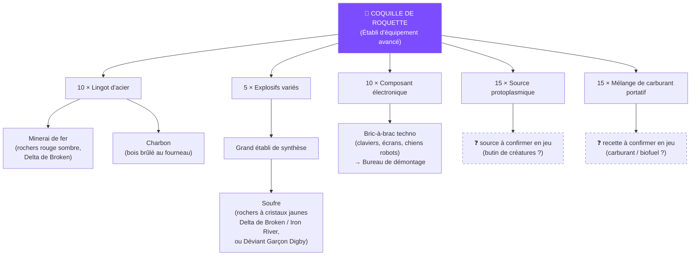

# Explosifs et munitions

*Dernière mise à jour : 6 septembre 2026 — recettes et fiches relevées en jeu PS5 ✅*

Tout ce qui explose : quoi débloquer, quoi fabriquer, à quel coût — et lequel choisir selon la cible.

## Comment lire une fiche d'explosif

La ligne clé : *« Très efficace contre les structures de **niv. X** ou inférieur en stabilité »*. C'est la **stabilité du matériau visé** (rien à voir avec votre niveau).

**Échelle corrigée terrain ✅** : **bois = niv. 1** (pas 2 comme le disaient les guides PC), pierre et béton aux niveaux supérieurs, et **il n'existe pas de matériau constructible de niv. 4** : le « béton niv. 4 » cité par certaines fiches désigne les bâtiments du monde, pas les constructions de joueurs. ⚠️ Vérifié sur fiches (08/09/2026) : les fiches de **structures** n'affichent **pas** de numéro de stabilité (Durabilité + Coût seulement) — ces niveaux ne se lisent que sur les fiches d'**explosifs**. Autre piège : dans le jeu, le palier « **pierre** » s'appelle « Mur/Plafond en pierre 01 » mais sa description dit *« Mur de briques »* — **pierre et brique sont un seul et même palier** (1 800 PV, contre 3 200 au béton).

Conséquence : la **Grenade** de base (« très efficace niv. 1 ») devrait donc être **efficace sur le bois** — à re-tester avant de la disqualifier. Aucun explosif n'est « anti-joueurs uniquement » — tout touche tout, seule l'efficacité change.

## Le comparatif (phase 1), du plus au moins rentable contre les structures

| Outil | Dégâts | Casse quoi | Fabrication / déblocage |
|---|---|---|---|
| 🥇 **Balles** | — | **Bois** (vérifié en zone d'affrontements ✅) | Quasi gratuit — l'option éco quand la zone est calme |
| 🥈 **Explosifs surpuissants** ✅ | **3639** + 800 % Psi (~1100 effectifs/structure) | **Bois + pierre** (niv. 3) | **Arbre Tech, 180 points** — dispo dès la phase 1. Établi de synthèse, 30 s : 15 lingots d'acier alliage + 3 Explosifs variés + 10 plastique* + 2 composants |
| **Coquille de roquette** ✅ (RPG7) | 297/tir (rang II) | **Bois + pierre** (niv. 3) | ⚠️ **Retour terrain : peu rentable** comparée aux Explosifs surpuissants — coût élevé (5 Explosifs variés + acier + protoplasme/tir) pour moins d'effet. À réserver au tir à **distance** (tourelles actives) |
| **Ogive de fusée plasma rouge** ✅ | **+30 % dégâts constructions** | Cibles coriaces | Même établi, matériaux rares — à réserver pierre/béton |
| **Grenade HE** ✅ | — | *Vérifiez sa ligne « niv. X » en jeu* | Débloquée (branche Établi de synthèse des Mémétiques) |
| **Grenade** de base ✅ (×8/craft) | 698 | Niv. 1 = **le bois** (échelle corrigée) — à re-tester sur fondations bois | Anti-personnel, et peut-être plus utile qu'on ne le pensait |

*\* icône du plastique à confirmer. Les « Explosifs améliorés » des wikis PC n'ont pas été retrouvés sur PS5 — les Explosifs surpuissants les remplacent.*

## Le goulot de toute la chaîne : Explosifs variés → soufre

Grenades, surpuissants, roquettes : **tout** consomme des **Explosifs variés** ✅ (fabriqués au **Grand établi de synthèse**, à base de **soufre**). La puissance de feu se mesure donc en soufre : rochers à **cristaux jaunes** (Delta de Broken, Iron River) ou Déviant **Garçon Digby** en farm passif — voir [Ressources](../jeu/ressources.md#soufre). File de production en continu !

## Arbre de production des roquettes

## Le RPG7

- **Le lanceur** (« RPG7 — Schéma : lance-roquette » ✅) : Mémétiques (points mémétiques), coffres mystérieux, ou Machine à vœux. Stats rang II relevées : **297 DÉG**, chargeur de **1**, +25 % critique/points faibles, trait *« très efficace contre les structures de niv. 3 ou inférieur »*. Existe en rangs II → V — refabriquez-le à un rang supérieur au fil de la saison.
- **Les Coquilles de roquette** se **lootent** aussi (conteneurs, ennemis) et s'achètent aux **distributeurs** d'autres joueurs.
- Le **Résonateur protoïde** (détection des Entraves en guerre de frontières) se fabrique au Grand établi de synthèse — voir [Guerres de frontières](../guerre/frontieres.md).

## Munitions : les recettes exactes (capturées ✅ 08/09/2026)

Tout se fabrique à l'**Établi de fournitures avancé** (5 s par craft) :

| Munition (×240/craft) | Recette | Bonus |
|---|---|---|
| **Munitions à noyau d'acier de calibre moyen** | 7 Lingots d'acier + 2 Poudre à canon + 12 Source protoplasmique | +8 % DÉG par tir, +8 % Intensité Psi |
| **Munitions perforantes de calibre moyen** | 7 Lingots de **tungstène** + 2 Poudre à canon + 20 Source protoplasmique | +15 % DÉG, +15 % Psi, **+20 % contre les unités blindées** |

Les ingrédients intermédiaires :

| Ingrédient | Recette | Où |
|---|---|---|
| **Poudre à canon** (×1) | 6 Soufre + 3 Charbon + **3 Acide** | Établi de fournitures avancé |
| **Lingot de tungstène** | 5 Minerais de tungstène + **1 Acide** | **Fourneau électrique** |

L'**Acide** n'entre donc pas directement dans les balles : il passe par la **poudre à canon** et le **tungstène** — mais chaque craft de 240 perforantes coûte au total ~13 acides en amont. La **Source protoplasmique** (fioles roses/violettes) reste à stocker en priorité : 12 à 20 par craft.

**La voie industrielle de l'acide ✅ (chaîne complète capturée)** : **pompes à eau → eau contaminée → Filtre à eau compact (2:1) → Eau purifiée → Cuve de brassage (10:1) → Acide**. Une [ferme à eau](../jeu/base-territoire.md#la-ferme-a-eau-retour-terrain-ps5-08092026) à 8 pompes ≈ 40 000 eaux/semaine ≈ **2 000 acides/semaine** — de quoi alimenter poudre, tungstène et Équipements de sécurité sans chasser un seul Déviant.

## La rétro-ingénierie : l'autre voie de déblocage

**Le système, vérifié terrain PS5 ✅** — l'établi s'appelle le **« Banc de synthèse technologique »** et a **deux onglets** :

**Onglet « Rétro-ingénierie »** :

1. Placez-y les objets marqués d'une **icône jaune** (lootés en exploration ou récupérés sur les installations ennemies).
2. **La première fois** qu'un objet y passe → son **craft se débloque** (sans dépenser de points Tech !).
3. **Les fois suivantes**, le même objet donne des **ossements** — la monnaie qui sert à **acquérir de nouveaux crafts** (c'est probablement elle qui chiffre les gros déblocages, comme l'établi de munitions vu à « 6000 »).

**Onglet « Inventions technologiques »** ✅ : on y place des **matériaux** (« Matériaux d'invention ») → l'« Aperçu du résultat de l'invention » montre les machines/objets que la combinaison peut produire → **« Activer l'invention »** (~3 min). C'est une seconde voie de découverte : expérimentez des combinaisons de matériaux pour inventer de nouvelles installations. *(À documenter : les combinaisons connues.)*

**Doctrine de la faction** : *favoriser la récupération des installations et la rétro-ingénierie* — en raid comme en exploration, **ramenez tout objet à icône jaune** au lieu de le broyer, et récupérez les installations ennemies quand c'est possible plutôt que de tout détruire. Chaque objet analysé = un craft gratuit ou des ossements.

## Déblocages et verrous de phase

- **Explosifs surpuissants : PAS bloqués en phase 1** (vérifié ✅) — Arbre Tech, 180 points Tech, à débloquer en priorité absolue.
- Branche **Établi de synthèse** des Mémétiques (Grenade → Mines Claymore → Grenade HE) : disponible tôt.
- Équipement de **palier 5** : verrouillé (niveau 40 + phases suivantes). Corps d'arme **palier IV** : derrière le mur rouge (zones niv. 30+) en phase 1.
- Astuce faction : un seul membre paie le déblocage et produit pour tous sur ses établis partagés.

## Voir aussi

- [Prendre une zone d'affrontements](../guerre/prise-de-zone.md) — les PV des structures et combien de bombes prévoir
- [Ressources : où trouver quoi](../jeu/ressources.md)
