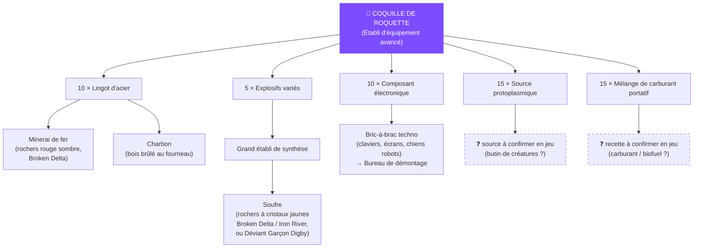

# Conquête de bastion (GvG) et factions armées

*Dernière mise à jour : 6 septembre 2026*

Le mode GvG (guilde contre guilde) des serveurs PvP s'appelle la **Conquête de bastion** (*Stronghold Conquest*). C'est l'activité centrale du scénario PvP : le classement de fin de saison se joue principalement sur les points gagnés dans ce mode.

## Rejoindre une faction armée (Warband)

Participer exige d'être membre d'une **faction armée** (*Warband*) — l'équivalent d'une guilde :

1. Menu principal → **« S'unir » (Get United)** → **Faction armée (Warband)**.
2. La liste affiche les factions du serveur avec le nom du chef et le nombre de membres.
3. Cliquez sur **Rejoindre** : certaines factions acceptent automatiquement, d'autres exigent la validation du chef.
4. Rejoindre est **gratuit** ; en créer une coûte **800 Liens d'énergie**.
5. Capacité initiale : **30 joueurs**, extensible au fil de la saison.

### Côté chef : faire venir des joueurs dans votre faction

Vous avez créé votre faction ? Les joueurs vous rejoignent par la même liste :

- Ils ouvrent **« S'unir » → Faction armée**, tapent le **nom de votre faction** dans la barre de recherche (ou la trouvent dans la liste) et cliquent **Rejoindre**.
- Ce qui se passe ensuite dépend du réglage choisi à la création :
    - **Adhésion automatique** : ils deviennent membres immédiatement.
    - **Sur candidature** : vous devez **valider leurs demandes** dans le menu de la faction (en tant que fondateur, vous y voyez les candidatures en attente).
- Pour recruter activement, faites passer le nom exact de la faction à vos amis (chat du serveur, chat de proximité) — la recherche par nom est le moyen le plus fiable de vous trouver.
- Un **tableau de recrutement** permet aussi d'annoncer sa faction aux joueurs sans guilde. *À confirmer en jeu sur PS5 : emplacement exact du tableau et des réglages d'adhésion après création.*

## Le principe du mode

Sur la carte, des **régions contestables** (bastions moyens et points de ressources, appelés *Frontiers*) peuvent être **occupées par une faction armée**. La faction qui occupe une zone en tire des ressources — les autres factions peuvent la lui prendre en déclarant une **Conquête de bastion** : un combat attaque/défense entre deux factions.

Particularité : ces zones contestables ne sont **pas découpées en instances (« Mondes »)** — tous les joueurs du serveur s'y voient, et le PvP y est libre contre quiconque n'est pas de votre camp (l'icône rouge **« GVG »** s'affiche en haut à droite de l'écran quand vous y êtes).

## Sur place : que faire dans la zone ?

Une fois la faction créée et arrivé dans une zone contestable, deux cas :

### La zone est libre (non occupée)

- L'occupation passe par un système d'**enchères de la faction** : le chef mise de la monnaie via l'interface de la faction/de la carte pour prendre l'occupation d'une zone libre. On ne peut pas enchérir sur une zone déjà occupée par une autre faction — il faut alors lui déclarer la guerre.
- Sur le terrain, la prise de possession se matérialise en posant un **Équipement de sécurité** : Mode construction → Installations → **Installations extérieures** (dernier onglet) → Équipement de sécurité. ⚠️ Si cet équipement est détruit, la faction **perd l'occupation** — défendez-le.
- *À confirmer en jeu (PS5, version actuelle) : le détail exact enchères vs pose d'équipement selon le type de zone (bastion / point de ressources / zone d'engagement) — les retours communautaires divergent et l'interface a évolué depuis le lancement PC.*

### La zone est occupée par une faction ennemie

- Le chef **déclare la guerre** sur la zone visée depuis la carte/l'interface de faction.
- La bataille n'a pas lieu immédiatement : elle est **programmée sur des créneaux fixes** (sur PC : mercredi, vendredi et dimanche, toujours à la même heure — *horaires exacts côté serveurs console EU à confirmer*).
- Au créneau prévu, la zone devient champ de bataille : votre faction attaque depuis son **camp d'attaquant**, l'objectif est de **détruire les balises** du défenseur avant la fin du chrono (voir ci-dessous).

### En attendant la bataille

- Dans la zone, l'icône **GVG** signifie PvP libre : vous pouvez tuer (et être tué par) tout joueur qui n'est pas de votre camp, et **piller** les points de la zone.
- Profitez-en pour repérer les lieux, les balises ennemies et les accès véhicules.

## Attaque et défense

- Les icônes **« Attaque »** sur la carte marquent les zones où votre faction a déclaré (ou subit) une bataille.
- **Zone d'attaque** = un bastion occupé par une faction ennemie que votre faction attaque.
- **Zone de défense** = un bastion que votre faction occupe et qu'une faction ennemie attaque.
- **Objectif de l'attaquant** : détruire les **balises (beacons)** protégées par le défenseur **avant la fin du temps imparti** → la zone change de mains.
- **Objectif du défenseur** : tenir jusqu'à la fin du chrono.

### La « base de l'attaquant »

Quand votre faction est en position d'attaquant, un **camp d'attaque** est établi en bordure de la zone contestée : c'est le point de ralliement et de **réapparition** de votre camp pendant la bataille — vous y réapparaissez à la mort et vous vous y regroupez avant l'assaut, au lieu de repartir de votre territoire personnel. *À confirmer en jeu : emplacement exact et ce qu'on peut y construire/déployer.*

## Phases de la saison

Dans le scénario PvP à phases (ex : Evolution's Call, 5 phases), le mode monte en puissance avec la saison : en **phase 1**, les premières zones contestables ouvrent dans les régions de départ, puis chaque phase ouvre de nouvelles régions (et de nouveaux bastions) — d'où les zones d'attaque/défense visibles dès maintenant sur votre serveur. Voir aussi [Phases de serveur](multijoueur-pvp.md#phases-de-serveur-le-mur-rouge).

## Détruire les structures ennemies (fondations, murs…)

Une faction ennemie a posé des fondations autour de l'objectif ? Dans la zone GvG, ses structures sont destructibles — mais **les armes classiques ne font quasiment rien aux bâtiments** : il faut des **explosifs**, et leur efficacité dépend du niveau de **stabilité** du matériau visé :

| Explosif | Fabrication | Efficace contre | Limite |
|---|---|---|---|
| **Grenade** ✅ (fabriquée ×8, « dégâts modérés ») | Mémétiques → branche **Établi de synthèse**, 1er nœud (relevé en jeu PS5) — recette : lingots, poudre à canon, Source protoplasmique, carburant | Toutes cibles, mais dégâts de structure faibles | Anti-personnel avant tout — utilisable sur du bois en dépannage |
| **Explosifs améliorés** (Improved Explosives) | **Établi de synthèse** : 10 plastique ignifugé + 10 caoutchouc + 3 Explosifs variés + 1 pièce électronique | Bois (stabilité niv. 2 max) | Dégâts réduits dès le niv. 3 (pierre) — ~2700 dégâts |
| **Explosifs puissants** (High Explosives) | **Grand établi de synthèse** (Advanced Synthesis Bench) | Bois + pierre (stabilité niv. 3 max) | Dégâts réduits sur le niv. 4 (béton) |
| **Lance-roquettes (RPG7), MGL, C4** | Armes lourdes, plus tard dans la progression | Le haut du panier pour percer les défenses | Coûteux, accessibles en milieu/fin de saison |

Les **Explosifs variés** ✅ (*Mixed Explosives*, l'ingrédient clé — fabriqués au **Grand établi de synthèse**) demandent notamment du **soufre** — voir [Ressources : le soufre](ressources.md#soufre) pour le farmer efficacement.

!!! tip "La branche explosifs des Mémétiques (relevée en jeu PS5)"
    Dans les Mémétiques, la ligne sous **« Établi de synthèse »** contient : **Grenade** → **Mines Claymore** → **Grenade HE**. La branche voisine **« Sacs de sable »** → **Protecteur** → **Mannequin de tir** sert à la défense. Les **Mines Claymore** sont d'ailleurs excellentes pour défendre votre propre zone/Équipement de sécurité une fois la zone prise.

!!! note "Grenades vs structures : comment lire les objets"
    Aucun explosif n'est « contre les joueurs uniquement » : tout inflige des dégâts aux joueurs, créatures **et** structures. Ce qui change, c'est l'efficacité — chaque objet l'indique dans sa fiche par la ligne *« Très efficace contre les structures de niv. X ou inférieur en stabilité »*. La **Grenade** de base est surtout anti-personnel — sa fiche (relevée en jeu PS5) : *« Faible pouvoir de destruction contre les bâtiments. […] Très efficace contre les structures de niv. 1 en stabilité (créatures touchées par la peste argentée). Dégâts progressivement réduits contre les structures de niv. 2 ou supérieur. »* Or les fondations en bois sont **niv. 2** : les grenades y sont inefficaces. Pour raser des fondations, privilégiez la **Grenade HE** et surtout les **Coquilles de roquette** (le RPG7 affiche « niv. 3 ou inférieur »).

### RPG7 : obtenir le lanceur et ses roquettes

- **Le lanceur** (« RPG7 — Schéma : lance-roquette » ✅) : plan achetable dans les **Mémétiques** (onglet Fabrication, avec des points mémétiques), trouvable dans des coffres mystérieux aux points d'intérêt, ou via la **Machine à vœux** (Starchrom). Stats relevées en jeu PS5 (rang II) : **297 DÉG**, chargeur de **1** (rechargement entre chaque tir), cadence 40, +25 % DÉG critiques et points faibles. Le trait du jeu confirme : *« Très efficace contre les structures de niv. 3 ou inférieur en stabilité »* — bois et pierre. L'arme existe en plusieurs **rangs** (II → V) : la refabriquer à un rang supérieur augmente ses dégâts au fil de la saison.
- **Les roquettes** s'appellent **« Coquille de roquette »** ✅ (*Rocket Shell* — « ogive spéciale pour lance-roquettes », modifiable dans le sac à dos pour changer de type de munitions). Recette relevée en jeu sur PS5 (06/09/2026), fabrication en 5 s :
    - 10 × Lingot d'acier
    - 5 × **Explosifs variés** — se fabriquent au **Grand établi de synthèse** ✅ (ou à l'Établi de fournitures avancé en Mode Zone de Raid) ; c'est l'ingrédient au soufre, voir [Ressources](ressources.md#soufre)
    - 15 × Source protoplasmique
    - 10 × Composant électronique
    - 15 × Mélange de carburant portatif
- Elles se **ramassent aussi en loot** (conteneurs, ennemis) dans la plupart des régions, et s'achètent parfois aux **distributeurs** des autres joueurs contre des Liens d'énergie.
- **Variante anti-structures : l'Ogive de fusée plasma rouge** ✅ (*Red Plasma Rocket Warhead*, relevée en jeu PS5) : **+30 % de dégâts aux constructions**, +30 % aux véhicules, et dégâts massifs aux boucliers de la Peste d'argent (Prime War). Se fabrique au même établi (5 s) mais avec des matériaux plus rares (dont un lingot spécial et de la Source protoplasmique). C'est la munition à sortir contre les fondations coriaces (pierre/béton) — pour du simple bois, la Coquille de roquette standard ou les explosifs suffisent.
- Astuce faction : un seul membre débloque/pose l'établi nécessaire, et toute la faction fabrique dessus via les permissions de base partagées.

### Arbre de production des roquettes

Du haut (l'objet final) vers le bas (les ressources à farmer) :

*Les feuilles marquées ❓ restent à confirmer en jeu — si vous voyez la recette exacte (fer/charbon du lingot d'acier, composition des explosifs variés, du carburant portatif et de la source protoplasmique), [contribuez](../contribuer.md) !*

Conseils :

- **Visez l'élément le plus faible** : une fondation ou un mur en bois cède bien plus vite que du béton — ouvrez une brèche au point le plus fragile plutôt que de taper le mur le plus épais.
- Si les fondations **entourent un générateur ou l'Équipement de sécurité** de la faction ennemie (l'installation au milieu), c'est ça la vraie cible : détruire l'Équipement de sécurité fait **perdre l'occupation** à la faction adverse, et détruire un **générateur** coupe le courant de ce qu'il alimente (tourelles automatiques comprises) — le neutraliser en premier facilite tout le reste de l'assaut.
- Arrivez en **véhicule**, posez les charges, reculez — et prévoyez un gros stock d'explosifs : les assauts en consomment beaucoup.
- En défense, c'est l'inverse : multipliez les couches de murs (« honeycombing ») et montez en matériaux de stabilité élevée.

*À confirmer en jeu : recettes/déblocage exact des explosifs dans les Mémétiques et dégâts précis par palier sur la version actuelle.*

## Tactiques de base

**Attaquants :**

- Utilisez des **véhicules** pour traverser vite la zone jusqu'aux bases ennemies.
- **C4 et roquettes** pour percer les défenses et détruire les balises.

**Défenseurs :**

- Tenez les **positions en hauteur** et les points fortifiés.
- Placez des **tourelles automatiques** aux goulots d'étranglement.

## Rappels utiles

- PvP **bloqué sous le niveau 10** (voir [Multijoueur et PvP](multijoueur-pvp.md)).
- Hors de ces zones GvG, votre base personnelle ne peut **pas** être pillée et vous ne subissez pas de dégâts joueurs, sauf État de Chaos activé volontairement.

## Sources

- [Game Truth — guide PvP Once Human](https://www.gametruth.com/guides/once-human-guide-how-to-win-in-pvp/)
- [BlueStacks — guide des modes PvP](https://www.bluestacks.com/blog/game-guides/once-human/ohn-pvp-guide-en.html)
- [Dot Esports — l'icône « Attack » sur la carte](https://dotesports.com/once-human/news/whats-the-attack-icon-on-the-once-human-map-mean)
- [Gamerant — créer et rejoindre une Warband](https://gamerant.com/once-human-how-create-join-warbands/)
- [Gamerant — les scénarios expliqués](https://gamerant.com/once-human-scenario-explained/)
