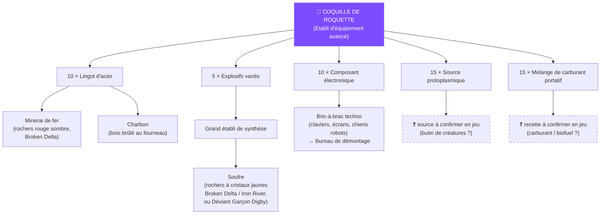

# Conquête de bastion (GvG) et factions armées

*Dernière mise à jour : 6 septembre 2026 — guide construit et vérifié en jeu sur PS5 (phase 1, scénario PvP). Les éléments marqués ✅ sont relevés directement à l'écran.*

Le GvG (guilde contre guilde) est l'activité centrale des serveurs PvP : des factions s'affrontent pour le contrôle de zones qui produisent des ressources, et le classement de fin de saison en dépend. Cette page couvre tout : rejoindre une faction, prendre une zone, l'arsenal de démolition et la préparation d'un raid.

---

## 1. La faction armée (Warband)

Tout commence par une **faction armée** — l'équivalent d'une guilde.

**Rejoindre une faction :** Menu principal → **« S'unir »** → **Faction armée** → cherchez son nom dans la liste ou la barre de recherche → **Rejoindre**. C'est gratuit ; selon le réglage de la faction, l'adhésion est automatique ou soumise à la validation du chef.

**Créer une faction :** 800 Liens d'énergie, 30 places au départ (extensible au fil de la saison).

**Côté chef :** les candidatures arrivent dans le menu de la faction. Pour recruter, faites circuler le **nom exact** de la faction (la recherche par nom est le moyen le plus fiable d'être trouvé) ; un tableau de recrutement permet aussi de s'annoncer. *(Emplacement exact du tableau sur PS5 : à confirmer.)*

---

## 2. Les deux modes de GvG — ne les confondez pas

| | 🏭 **Zone d'engagement** | ⚔️ **Guerre de bastion déclarée** |
|---|---|---|
| C'est quoi | Une zone ouverte autour de **sites d'extraction** (foreuses à ressources) | Une bataille programmée entre deux factions pour une frontière |
| Déclaration | ❌ Aucune — on entre, on détruit, on occupe | ✅ Le chef déclare la guerre via l'interface |
| Quand | À tout moment, PvP libre permanent | Créneaux fixes (PC : mercredi/vendredi/dimanche à heure fixe — *horaires console EU à confirmer*) |
| Objectif | Occuper un **site d'extraction** | Détruire les **Entraves protoïdes** du défenseur avant la fin du chrono |
| Qui possède | La **Ruche** (groupe de bases), via **enchères** | La **faction armée** |

Dans les deux cas : ces zones ne sont **pas instanciées** — tout le serveur s'y croise, et l'icône rouge **« GVG »** à l'écran signale que le PvP y est libre contre quiconque n'est pas de votre camp.

---

## 3. Prendre une zone d'engagement (guide vérifié terrain ✅)

La zone s'articule autour de ses **sites d'extraction** : tant que votre camp n'en occupe pas un, **tout est verrouillé** — construction ET interactions. Messages du jeu relevés sur PS5 : *« Aucun permis de construire pour cette zone »*, *« Pour poser un générateur : vous devez d'abord occuper un site d'extraction »*, *« Aucun accès. Vous devez d'abord occuper un site d'extraction »*.

Le HUD de la zone affiche des compteurs (ex. `0/12`) avec les pseudos des occupants — le décompte des sites tenus par équipe.

### La séquence de prise

**Étape 1 — Raser les défenses de l'occupant.** Bonne nouvelle vérifiée en jeu : **les structures en bois tombent même sous les balles** dans ces zones (lent mais gratuit). Les explosifs servent à aller plus vite et à percer la pierre (voir [l'arsenal](#5-larsenal-de-demolition-phase-1)).

**Étape 2 — Détruire les installations qui tiennent la zone**, dans cet ordre d'efficacité :

1. Le **générateur** ennemi → coupe le courant de tout ce qu'il alimente, **tourelles automatiques comprises**.
2. Les **relais électriques** reliés au générateur (suivez les câbles).
3. L'**Équipement de sécurité** ennemi — une tour « R.S.T » sur trépied à deux modules : c'est **elle** qui matérialise leurs droits sur la zone.

**Étape 3 — Remporter l'occupation.** Détruire ne suffit pas : la prise passe par le système d'**enchères** de la faction (interface de faction/carte) et/ou une interaction sur la foreuse. *(Écran d'enchères exact, monnaie et durées : à documenter — premiers retours bienvenus.)* C'est la **Ruche** qui devient propriétaire (patch notes officiels) : soyez groupés en Ruche.

**Étape 4 — Poser votre Équipement de sécurité** (fiche officielle ✅ : *« Équipement de sécurité pour gérer les droits de zone d'engagement »*). Recette :

| Matériau | Quantité | Source |
|---|---|---|
| Lingot de cuivre | 20 | Minerai de cuivre au fourneau |
| Lingot de fer | 10 | Minerai de fer au fourneau |
| Pièces | 8 | Exploration, démontage de déchets |
| Composant électronique | 3 | Bric-à-brac techno au Bureau de démontage |
| **Acide** | 5 | **Déviants** et exploration de la nature |
| Câble d'alimentation | 1 | Exploration ou Boutique |

**Étape 5 — Fortifier immédiatement.** Votre équipement devient la cible : s'il est détruit, vous perdez la zone. Mines Claymore, sacs de sable, tourelles (avec un générateur à vous), murs. Les 10 premières minutes après la prise sont les plus dangereuses — la faction délogée revient souvent.

---

## 4. La guerre de bastion déclarée (frontières)

Pour prendre une frontière **occupée par une faction ennemie** :

1. Le chef **déclare la guerre** sur la zone (carte / interface de faction).
2. La bataille se joue au **créneau programmé**. Votre camp attaque depuis son **camp d'attaquant** en bordure de zone — votre point de réapparition pendant la bataille.
3. **Objectif attaquant** : détruire les **Entraves protoïdes** ✅ (*Staroid Restrainers*) protégées par le défenseur avant la fin du chrono. **Objectif défenseur** : tenir.

**Trouver les Entraves :** elles sont cachées dans la zone — sur la carte, une Entrave repérée apparaît comme un **cercle blanc** (zone approximative). L'outil dédié est le **Résonateur protoïde** (objet tactique : *« détecte les entraves protoïdes dans un rayon de X mètres »*). Recette au **Grand établi de synthèse** : 25 bouts de ferraille + 25 adhésif + 25 caoutchouc + 10 composants électroniques + 15 Source protoplasmique. Usage unique — prévoyez-en plusieurs.

---

## 5. L'arsenal de démolition (phase 1)

### Comment lire une fiche d'explosif

La ligne clé de chaque fiche : *« Très efficace contre les structures de **niv. X** ou inférieur en stabilité »*. C'est la **stabilité du matériau** visé (rien à voir avec votre niveau) : bois = niv. 2, pierre = niv. 3, béton = niv. 4. Pas de ligne ou « dégâts modérés » = mauvais outil de démolition. Aucun explosif n'est « anti-joueurs uniquement » — tout touche tout, seule l'efficacité change.

### Ce qui marche en phase 1, du plus au moins rentable

| Outil | Dégâts | Casse quoi | Coût / déblocage |
|---|---|---|---|
| 🥇 **Balles** | — | **Bois** (vérifié terrain ✅) | Quasi gratuit — l'option éco quand la zone est calme |
| 🥈 **Explosifs surpuissants** ✅ | **3639** + 800 % Psi | **Bois + pierre** (niv. 3), réduit sur béton | **Arbre Tech, 180 points** — dispo dès la phase 1. Établi de synthèse, 30 s/pièce : 15 lingots d'acier alliage + 3 Explosifs variés + 10 plastique* + 2 composants |
| 🥉 **Coquille de roquette** ✅ (RPG7) | 297/tir (lanceur rang II) | **Bois + pierre** (niv. 3) | Établi d'équipement avancé, 5 s : 10 lingots d'acier + 5 Explosifs variés + 15 Source protoplasmique + 10 composants + 15 carburant portatif. Sa valeur : **tirer à distance** (chargeur de 1 → couvert entre chaque tir) |
| **Ogive de fusée plasma rouge** ✅ | +30 % dégâts constructions | Les cibles coriaces | Même établi, matériaux rares — à réserver pierre/béton |
| **Grenade HE** ✅ | — | *Vérifiez sa ligne « niv. X » en jeu* | Débloquée (branche Établi de synthèse des Mémétiques) |
| ❌ **Grenade** de base | 698 | Niv. 1 seulement — **inefficace sur le bois** | Gardez-les pour les joueurs |

*\* icône du plastique à confirmer. Les « Explosifs améliorés » décrits par les wikis PC n'ont pas été retrouvés sur PS5 en phase 1 — les Explosifs surpuissants les remplacent avantageusement.*

### Les PV des structures — mesurés en jeu ✅

Données relevées sur PS5 (06/09/2026) en visant les éléments ennemis :

| Élément | PV (durabilité) | Coût constaté pour le détruire |
|---|---|---|
| **Quart de plafond en bois massif** | **3 200** | **3 × Explosifs surpuissants** (vérifié en conditions réelles) |
| **Quart de fondations en marbre** | **6 400** | ~6 Explosifs surpuissants (estimation : PV doublés, marbre = pierre niv. 3, toujours « très efficace ») |

Ce qu'on en déduit :

- Un Explosif surpuissant inflige **~1 100 dégâts effectifs par PV de structure** sur du bois (3 200 ÷ 3) — le « 3639 » de la fiche est la valeur contre les créatures, les structures encaissent différemment.
- **Dimensionnez vos stocks** : comptez ~3 surpuissants par élément en bois, ~6 par élément en marbre/pierre, puis doublez pour la marge (ratés, réparations du défenseur).
- La durabilité de chaque élément s'affiche en le visant — vérifiez toujours les PV réels avant de dépenser vos bombes.

*À compléter : coût mesuré sur le marbre, et PV des murs/portes.*

### Le goulot de toute la chaîne : les Explosifs variés

Grenades, Explosifs surpuissants, Coquilles de roquette : **tout** consomme des **Explosifs variés** ✅ (fabriqués au **Grand établi de synthèse**, à base de **soufre**). La puissance de feu de la faction se mesure donc en soufre : rochers à **cristaux jaunes** (Broken Delta, Iron River) ou Déviant **Garçon Digby** en farm passif — voir [Ressources](ressources.md#soufre). Faites tourner la file de production en continu.

### Arbre de production des roquettes

Le lanceur lui-même (« RPG7 — Schéma : lance-roquette » ✅) s'obtient dans les Mémétiques (points mémétiques), en coffres mystérieux, ou à la Machine à vœux. Il existe en rangs II → V : refabriquez-le à un rang supérieur au fil de la saison. Les roquettes se **lootent** aussi (conteneurs, ennemis) et s'achètent aux **distributeurs** des autres joueurs.

### Verrous de la phase 1

- Équipement de **palier 5** : verrouillé (lié au niveau 40 et aux phases suivantes).
- Corps d'arme **palier IV** : lootés dans les zones niveau 30+ (Chalk Peak…), **derrière le mur rouge** en phase 1.
- Certains nœuds coûteux des Mémétiques s'ouvrent aux phases suivantes — mais les **Explosifs surpuissants ne sont PAS bloqués** (vérifié en jeu ✅).

---

## 6. Préparer son raid : la checklist

Leçon du premier assaut (arrêté… faute de munitions) — chaque membre emporte :

- [ ] **Munitions ×2** de l'estimation — le bois tombe aux balles, mais ça en dévore.
- [ ] **Explosifs surpuissants** (30 s/pièce : lancez la production **avant** de partir).
- [ ] **Coquilles de roquette** si le RPG7 sort.
- [ ] **Résonateurs protoïdes** ×2-3 (guerres de bastion).
- [ ] **Kit de prise** : Équipement de sécurité pré-fabriqué, générateur, Mines Claymore, murs.
- [ ] **Soins et nourriture** — un siège dure toujours plus longtemps que prévu.

Et à la base arrière : un membre qui **produit pendant l'assaut** pour ravitailler.

**Répartition d'équipe** : 1-2 démolisseurs, 1 guetteur (tout le serveur vous voit en zone GVG), 1 porteur du kit qui re-teste la prise après chaque destruction.

**Astuce budget faction** : un seul membre débloque un nœud/établi coûteux et produit pour tous via les permissions de base partagées.

---

## 7. Rappels

- PvP **bloqué sous le niveau 10** (voir [Multijoueur et PvP](multijoueur-pvp.md)).
- Hors zones GvG, votre base personnelle est **impillable** et vous ne subissez aucun dégât joueur, sauf État de Chaos activé volontairement.
- Pas de tir ami dans votre équipe/faction, même aux roquettes.

## Sources

Guide construit sur des **relevés en jeu PS5** (captures et messages du jeu, 06/09/2026), complétés par :

- [Game Truth — guide PvP Once Human](https://www.gametruth.com/guides/once-human-guide-how-to-win-in-pvp/)
- [BlueStacks — guide des modes PvP](https://www.bluestacks.com/blog/game-guides/once-human/ohn-pvp-guide-en.html)
- [Dot Esports — l'icône « Attack » sur la carte](https://dotesports.com/once-human/news/whats-the-attack-icon-on-the-once-human-map-mean)
- [Gamerant — créer et rejoindre une Warband](https://gamerant.com/once-human-how-create-join-warbands/)
- [wikily.gg — fiches d'objets](https://wikily.gg/fr/once-human/)
